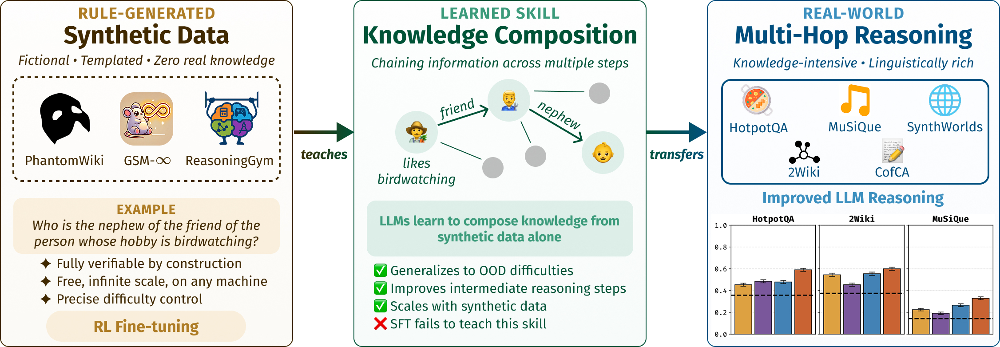

# Phantom Reasoning

**[Learning from Synthetic Data Improves Multi-hop Reasoning](https://arxiv.org/abs/2603.02091)** — ICLR 2026

[](https://arxiv.org/abs/2603.02091)
[](https://huggingface.co/datasets/kilian-group/phantom-reasoning)
[](https://iclr.cc/Conferences/2026)

We RL fine-tune on rule-generated synthetic data (PhantomWiki, GSM-Infinite, ReasoningGym) and show transfer to real-world multi-hop reasoning  (HotpotQA, 2Wiki, Musique, CofCA, SynthWorlds-RM).

<p align="center">
  
</p>

## Installation

**Prerequisites:** Python 3.12+, [uv](https://github.com/astral-sh/uv), [SWI-Prolog](https://www.swi-prolog.org/)

```bash
conda create -n phantom-reasoning
conda activate phantom-reasoning

conda install conda-forge::swi-prolog
conda install python=3.12
pip install uv

git clone git@github.com:kilian-group/phantom-reasoning.git
cd phantom-reasoning
uv pip install -e ".[dev]"
uv pip install flash-attn --no-build-isolation
pre-commit install
```

Set environment variables (persisted in the conda environment):

```bash
export CONDA_ENV_NAME="phantom-reasoning"
./scripts/setup_conda_env_vars.sh $CONDA_ENV_NAME
```

> For cluster-specific setup, see [docs/README_anvil.md](docs/README_anvil.md), [docs/README_aida.md](docs/README_aida.md), [docs/README_empire.md](docs/README_empire.md).

## Data

### Download from HuggingFace

All datasets are available on [HuggingFace](https://huggingface.co/datasets/kilian-group/phantom-reasoning).
Download all the zip files under `data/` and unzip them.

### Generate Synthetic Data

**PhantomWiki:** Generate splits using the [phantom-wiki](https://github.com/kilian-group/phantom-wiki) package. We use `depth_20_size_25` with `--easy-mode`; seeds 1–10 are reserved for evaluation, seeds 11+ for training.

**GSM-Infinite:** See [gsm_realistic/README.md](gsm_realistic/README.md) for generation instructions.

**ReasoningGym:**

```bash
python scripts/generate_reasoning_gym_data.py --dataset $task --size 12500 --train_frac 0.8 -od data/rg-family_relationships
python scripts/generate_reasoning_gym_data.py --dataset $task --size 12500 --train_frac 0.8 -od data/rg-knights_knaves
```

## LLM Training

Generate a training submission script (supported clusters: `aida`, `anvil`, `empire`, `unicorn`; omit for a generic setup):

```bash
./scripts/create_train_grpo__vllm_colocate.sh [cluster_name]
```

Then run GRPO training:

```bash
./scripts/train_grpo__vllm_colocate.sub \
    recipes/accelerate_configs/zero1.yaml \
    recipes/Qwen/Qwen3-1.7B/grpo/config_pw_4gpu.yaml
```

Checkpoints are saved at `./scratch/runs/<data_path>/<model>/<user>/<date>__<flags>`. YAML configs for other models and datasets are under `recipes/`.

> We trained several LLMs on PhantomWiki and GSM-Infinite, and share all checkpoints and predictions in `scripts/final_plots/final_ckpts.yaml`.

## LLM Evaluation

Quick start using vLLM on 1 GPU:

```bash
# Real-world wiki datasets (replace hp500 with 2wiki500, msq500, cofca500, synthrm500)
MODEL_NAMES="Qwen/Qwen3-1.7B" bash scripts/eval/wiki_eval_grpo.sh out__eval=wiki hp500 minidev

# PhantomWiki
MODEL_NAMES="Qwen/Qwen3-1.7B" bash scripts/eval/pw_eval_grpo.sh out__eval=pw

# GSM-Infinite
MODEL_NAMES="Qwen/Qwen3-1.7B" bash scripts/eval/gsminf_eval_grpo.sh out__eval=gsminf
```

See [docs/EVALUATION.md](docs/EVALUATION.md) for full evaluation instructions covering real-world Wiki datasets, PhantomWiki, GSM-Infinite, and reasoning evolution plots.

## Citation

```bibtex
@inproceedings{kabra2026learning,
  title={{Learning from Synthetic Data Improves Multi-hop Reasoning}},
  author={Kabra, Anmol and Gong, Albert and Yin, Yilun and Stankevi{\v{c}}i{\=u}t{\.e}, Kamil{\.e} and Go, Dongyoung and Luo, Katie Z and Lee, Johann and Gomes, Carla P and Weinberger, Kilian Q},
  booktitle={The Fourteenth International Conference on Learning Representations},
  year={2026},
  url={https://arxiv.org/abs/2603.02091}
}
```
