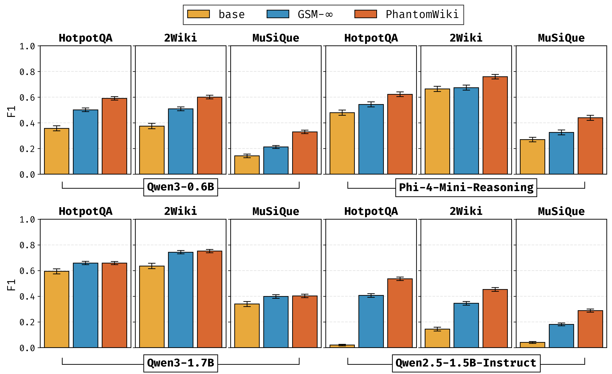
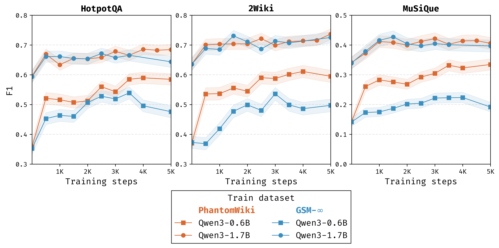
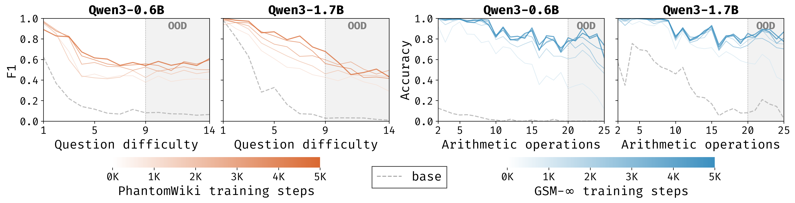
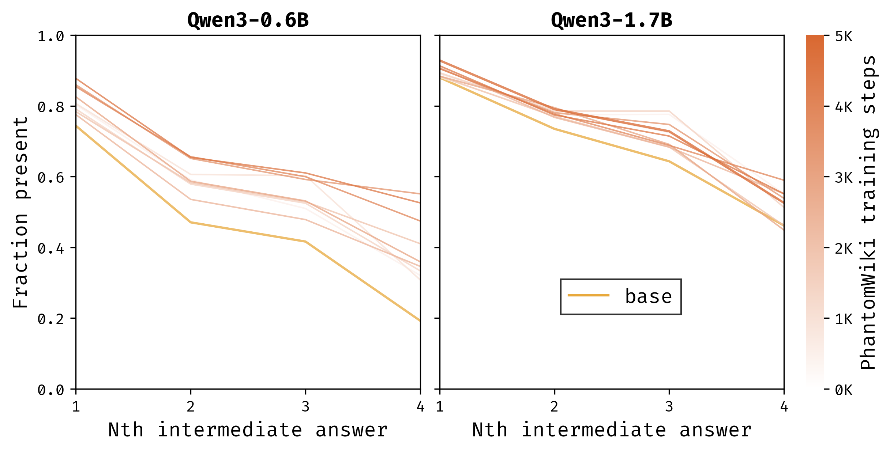

# Phantom Reasoning

We train LLMs with GRPO on synthetic multi-hop reasoning datasets such as PhantomWiki and GSM-Infinite, and show performance improvement to real-world multi-hop datasets such as HotpotQA, 2Wiki, Musique, CofCA, and SynthWorlds-RM.

## Installation

The Anvil cluster provides shared conda installation, which we recommend over installing in your home directory.
This avoids python path conflicts and saves limited memory in `~/`.

1. Load the shared conda installation.

```bash
./scripts/anvil/load_modules_cuda.sh
```

2. Install SWI-prolog, python, uv package manager, phantom-reasoning, flash-attn, and pre-commit.

```bash
export CONDA_ENV_NAME="phantom-reasoning" # or whatever the name of your conda environment is

conda create -n $CONDA_ENV_NAME
conda activate $CONDA_ENV_NAME

conda install conda-forge::swi-prolog
conda install python=3.12
pip install uv

git clone git@github.com:anmolkabra/phantom-reasoning.git
cd phantom-reasoning
uv pip install -e ".[dev]"
uv pip install flash-attn --no-build-isolation
pre-commit install
```

3. Set environment variables in the conda environment, so they are automatically loaded on activating the environment.

```bash
./scripts/setup_conda_env_vars.sh $CONDA_ENV_NAME

# If you are on the anvil cluster, pass "anvil" as the second argument to set the project iD
./scripts/setup_conda_env_vars.sh $CONDA_ENV_NAME anvil
```

## Dataset splits

We use several datasets for training and evaluating multi-hop reasoning:

- **PhantomWiki**: A synthetic, large-scale multi-hop QA dataset with variable universe size, depth, and seed. Used for both training and in-depth evaluation of reasoning skills.

- **GSM-Infinite**: An extension of GSM8K with high-complexity arithmetic and compositional reasoning questions. Used for both training and in-depth evaluation of arithmetic skills of models.

- **ReasoningGym**: A synthetic data generating framework, supporting puzzles and QA tasks (language, math, etc.). Used for both training and in-depth evaluation of reasoning skills. We use `family_relationships` and `knights_knaves` tasks.

- **HotpotQA, 2Wiki, Musique, CofCA, SynthWorlds-RM**: Real-world Wikipedia-based datasets that require multi-hop reasoning over unstructured text. Used to evaluate real-world transfer and generalization to natural language settings.

All datasets are split into training and evaluation sets to test both in-domain and out-of-domain generalization.
The Anvil cluster contains these splits in shared storage, which we symlink under `data/`:

```bash
ln -s /anvil/projects/x-$ANVIL_PROJECT_ID/phantom-reasoning/data .
```

On clusters without data in shared storage, please copy dataset splits from the Unicorn cluster as described below.

<details>
  <summary><h4 style="display:inline-block">PhantomWiki</h4></summary>

PhantomWiki paper used 3×3 evaluation splits available on Huggingface at `kilian-group/phantom-wiki-v1`: `depth_20_size_{50,500,5000}_seed_{1,2,3}`.

> \[!NOTE\]
> For this project, we use smaller universes, easy mode, and no aggregation questions. These are the easiest settings, due to small context length requirements for LLMs and easy questions, resulting in low GPU loads.

Specifically, we use splits `depth_20_size_25_seed_*` created with `--easy-mode`.

- **Seeds 1-10**: reserved for evaluation
- **Seeds 11+**: used for training

The datasets `depth_20_size_25_seed_{1,...,100}` are found on Unicorn at `/share/nikola/phantom-reasoning/data/wiki-v1-easy-depth_20_size_25.zip`.

```bash
mkdir -p data/
scp username@unicorn-login.coecis.cornell.edu:/share/nikola/phantom-reasoning/data/wiki-v1-easy-depth_20_size_25.zip data/

cd data/
unzip wiki-v1-easy-depth_20_size_25.zip
cd ..
```

</details>

<details>
  <summary><h4 style="display:inline-block">GSM-Infinite</h4></summary>

We have generated GSM-infinite data and stored it on Unicorn. See `gsm_realistic/README.md` for instructions to generate your own data.

```bash
mkdir -p data/
scp username@unicorn-login.coecis.cornell.edu:/share/nikola/phantom-reasoning/data/gsm-infinite-train.zip data/
scp username@unicorn-login.coecis.cornell.edu:/share/nikola/phantom-reasoning/data/gsm-infinite-eval.zip data/

cd data/
unzip gsm-infinite-train.zip
unzip gsm-infinite-eval.zip
cd ..
```

</details>

<details>
  <summary><h4 style="display:inline-block">ReasoningGym</h4></summary>

We have generated ReasoningGym data and stored it on Unicorn:

```bash
mkdir -p data/
for task in "family_relationships" "knights_knaves"; do scp username@unicorn-login.coecis.cornell.edu:/share/nikola/phantom-reasoning/data/rg-$task.zip data/; done

cd data/
for task in "family_relationships" "knights_knaves"; do unzip rg-$task.zip; done
cd ..
```

To generate your own data, run:

```bash
for task in "family_relationships" "knights_knaves"; do python scripts/generate_reasoning_gym_data.py --dataset $task --size 12500 --train_frac 0.8 -od data/rg-$task; done
```

</details>

<details>
  <summary><h4 style="display:inline-block">Real-world Wiki Datasets</h4></summary>

We collected HotpotQA (`hp`), 2Wiki (`2wiki`), Musique (`msq`), CofCA, and SynthWorlds-RM datasets, and subsampled 500 questions from the evaluation dataset in `hp500, 2wiki500, msq500, cofca500, synthrm500`.

We subsampled 500 entries from the CofCA and SynthWorlds-RM evaluation sets by running `python scripts/generate_cofca500_eval_data.py` and `python scripts/generate_synthrm500_eval_data.py` scripts.
We store these files in zip files for reproducibility.

```bash
mkdir -p data/
# Copy training data for first 3
for d in "hp" "2wiki" "msq"; do scp username@unicorn-login.coecis.cornell.edu:/share/nikola/phantom-reasoning/data/${d}.zip data/; done
for d in "hp" "2wiki" "msq" "cofca" "synthrm500"; do scp username@unicorn-login.coecis.cornell.edu:/share/nikola/phantom-reasoning/data/${d}500.zip data/; done

cd data/
for d in "hp" "2wiki" "msq"; do unzip ${d}.zip; done
for d in "hp" "2wiki" "msq" "cofca" "synthrm500"; do unzip ${d}500.zip; done
cd ..
```

</details>

## LLM training instructions

We describe training instructions specific to the Anvil cluster, which contain all trained checkpoints.
To train models on other clusters---please refer to cluster-specific instructions on [AIDA](docs/README_aida.md) and [Empire](docs/README_empire.md).

1. Create a symlink to directories with training checkpoints.

```bash
# experiment runs in scratch, linked to ./scratch
mkdir -p $RUN_BASE_DIR/runs
ln -s $RUN_BASE_DIR ./scratch

# shared models and evals linked to ./share
ln -s /anvil/projects/x-$ANVIL_PROJECT_ID/phantom-reasoning share
```

> \[!NOTE\] We trained several LLMs on PhantomWiki and GSM-infinite data, and share all checkpoints and predictions in paths listed in `./scripts/final_plots/final_ckpts.yaml`.

2. Run a GRPO training experiment on Qwen3-1.7B model with PhantomWiki data. We provide a script `./scripts/create_train_grpo__vllm_colocate.sh <cluster_name>` to create a bash slurm submission file, adding default variables for the specified cluster. This script creates `./scripts/train_grpo__vllm_colocate.sub` that executes a training job on a configuration. For instance,

   1. Using `salloc`:

   ```bash
   salloc -A $ANVIL_PROJECT_ID-ai -p ai --gres=gpu:4 -n 16 -N 1 --mem=100GB -t 12:00:00 --mail-type=all --mail-user=$USER_EMAIL

   # After getting an allocation:
   ./scripts/anvil/load_modules_cuda.sh
   conda activate $CONDA_ENV_NAME

   ./scripts/create_train_grpo__vllm_colocate.sh anvil

   ./scripts/train_grpo__vllm_colocate.sub \
   	recipes/accelerate_configs/zero1.yaml \
   	recipes/Qwen/Qwen3-1.7B/grpo/config_pw_4gpu.yaml
   ```

   2. Using `sbatch`:

   ```bash
   ./scripts/create_train_grpo__vllm_colocate.sh anvil

   ./scripts/train_grpo__vllm_colocate.sub \
   	recipes/accelerate_configs/zero1.yaml \
   	recipes/Qwen/Qwen3-1.7B/grpo/config_pw_4gpu.yaml
   ```

   Checkpoints and final model are saved at `./scratch/runs/data/wiki-v1-easy-depth_20_size_25/Qwen/Qwen3-1.7B/grpo/$USER/MMDD__<flags>`.

<details>
<summary><strong>YAML configurations for other datasets: TODO add reasoning gym</strong></summary>

- `recipes/Qwen/Qwen3-1.7B/grpo/config_gsminfinite_4gpu.yaml`
- `recipes/Qwen/Qwen3-1.7B/grpo/config_hp_4gpu.yaml` (on HotpotQA training data splits)
- `recipes/Qwen/Qwen3-1.7B/grpo/config_2wiki_4gpu.yaml` (on 2Wiki training data splits)
- `recipes/Qwen/Qwen3-1.7B/grpo/config_msq_4gpu.yaml` (on Musique training data splits)

</details>

<details>
<summary><strong>Similarly, YAML configurations for other LLMs:</strong></summary>

- `recipes/Qwen/Qwen3-0.6B/grpo/config_pw_4gpu.yaml`
- `recipes/Qwen/Qwen2.5-1.5B-Instruct/grpo/config_pw_4gpu.yaml`
- `recipes/microsoft/Phi-4-mini-reasoning/grpo/config_pw_4gpu.yaml`

</details>

## LLM evaluation instructions

We evaluate LLMs on evaluation splits of various datasets, such as 500 questions from evaluation splits of HotpotQA, 2wiki, Musique, CofCA, SynthWorlds-RM that exist in `./data/hp500, ./data/2wiki500, ./data/msq500`, `./data/cofca500`, `./data/synthrm500`.
We provide code to load these splits, get LLM predictions, and tabulate results in CSV files and output to the terminal.

### Real-world Wiki datasets

We can evaluate LLMs on real-world wiki datasets with the `scripts/eval/wiki_eval_grpo.sh` script:

```bash
# Assuming you have 1 GPU
# Replace hp500 with 2wiki500, msq500, cofca500, synthrm500
MODEL_NAMES="Qwen/Qwen3-1.7B" bash scripts/eval/wiki_eval_grpo.sh \
	out__eval=wiki \
	hp500 \
	minidev
```

<details>
<summary><h4 style="display:inline-block">Evaluating trained checkpoints</h4></summary>

We can also evaluate all trained checkpoints and their base models listed in `scripts/final_plots/final_ckpts.yaml`.

```bash
# Replace hp500 with 2wiki500, msq500, cofca500, synthrm500
MODEL_NAMES=$(python scripts/final_plots/get_model_names_of_final_ckpts.py --final_ckpts_yaml_path scripts/final_plots/final_ckpts.yaml --dataset_name base) \
	bash scripts/eval/wiki_eval_grpo.sh out__train=base__eval=wiki hp500 minidev

MODEL_NAMES=$(python scripts/final_plots/get_model_names_of_final_ckpts.py --final_ckpts_yaml_path scripts/final_plots/final_ckpts.yaml --dataset_name pw) \
	bash scripts/eval/wiki_eval_grpo.sh out__train=pw__eval=wiki hp500 minidev

MODEL_NAMES=$(python scripts/final_plots/get_model_names_of_final_ckpts.py --final_ckpts_yaml_path scripts/final_plots/final_ckpts.yaml --dataset_name gsminf) \
	bash scripts/eval/wiki_eval_grpo.sh out__train=gsminf__eval=wiki hp500 minidev

MODEL_NAMES=$(python scripts/final_plots/get_model_names_of_final_ckpts.py --final_ckpts_yaml_path scripts/final_plots/final_ckpts.yaml --dataset_name rg-family_relationships) \
	bash scripts/eval/wiki_eval_grpo.sh out__train=rg-family_relationships__eval=wiki hp500 minidev
```

For LLMs trained with PhantomWiki and GSM-Infinite, we provide a script to plot transfer performance to real-world wiki datasets:

```bash
python examples/wiki/create_bar_plots_performance_transfer.py \
	--final_ckpts_yaml_path scripts/final_plots/final_ckpts.yaml \
	--base_model_preds_dir "out__train=base__eval=wiki" \
	--pw_model_preds_dir "out__train=pw__eval=wiki" \
	--gsminf_model_preds_dir "out__train=gsminf__eval=wiki" \
	--figures_dir "scripts/final_plots/figures"
```

<p align="center">
  
</p>

We can further evaluate all intermediate training checkpoints on the real-world wiki datasets to visualize if training with PhantomWiki and GSM-Infinite is causing overfitting.

```bash
# Replace hp500 with 2wiki500, msq500, cofca500, synthrm500
bash scripts/eval/wiki_eval_all_ckpts.sh \
	./scratch/runs/data/wiki-v1-easy-depth_20_size_25/Qwen/Qwen3-1.7B/grpo/$USER/MMDD__<flags> \
	hp500 \
	minidev \
	Qwen/Qwen3-1.7B \
	pw

bash scripts/eval/wiki_eval_all_ckpts.sh \
	./scratch/runs/data/gsm-infinite-train/zero_context/realistic/Qwen/Qwen3-1.7B/grpo/$USER/MMDD__<flags> \
	hp500 \
	minidev \
	Qwen/Qwen3-1.7B \
	gsminf
```

After evaluating all intermediate training checkpoints of paths listed in `./scripts/final_plots/final_ckpts.yaml`, we provide a script to plot transfer performance as a function of training steps.

```bash
# NOTE: --dataset and --split flags are ignored, and the script creates a combined plot for hp500, 2wiki500, msq500
# TODO: update plots with cofca data
python examples/wiki/plot_all_wiki_scaling_final_ckpts.py \
    --final_ckpts_yaml_path scripts/final_plots/final_ckpts.yaml \
    --base_model_names_to_plot "Qwen/Qwen3-0.6B" "Qwen/Qwen3-1.7B" \
    --data_dir data \
    --dataset hp500 \
    --split minidev \
	--figures_dir "scripts/final_plots/figures"
```

<p align="center">
  
</p>
</details>

### PhantomWiki evaluation data

We can evaluate LLMs on PhantomWiki datasets with the `scripts/eval/pw_eval_grpo.sh` script.

```bash
# Assuming you have 1 GPU
MODEL_NAMES="Qwen/Qwen3-1.7B" bash scripts/eval/pw_eval_grpo.sh out__eval=pw
```

<details>
<summary><h4 style="display:inline-block">Evaluating trained checkpoints</h4></summary>

We can also evaluate all trained checkpoints and their base models listed in `scripts/final_plots/final_ckpts.yaml`.

```bash
MODEL_NAMES=$(python scripts/final_plots/get_model_names_of_final_ckpts.py --final_ckpts_yaml_path scripts/final_plots/final_ckpts.yaml --dataset_name base) \
	bash scripts/eval/pw_eval_grpo.sh out__train=base__eval=pw

MODEL_NAMES=$(python scripts/final_plots/get_model_names_of_final_ckpts.py --final_ckpts_yaml_path scripts/final_plots/final_ckpts.yaml --dataset_name pw) \
	bash scripts/eval/pw_eval_grpo.sh out__train=pw__eval=pw

MODEL_NAMES=$(python scripts/final_plots/get_model_names_of_final_ckpts.py --final_ckpts_yaml_path scripts/final_plots/final_ckpts.yaml --dataset_name gsminf) \
	bash scripts/eval/pw_eval_grpo.sh out__train=gsminf__eval=pw
```

</details>

### GSM-Infinite evaluation dataset

We can evaluate LLMs on GSM-Infinite questions with the `scripts/eval/gsminf_eval_grpo.sh` script.

```bash
# Assuming you have 1 GPU
MODEL_NAMES="Qwen/Qwen3-1.7B" bash scripts/eval/gsminf_eval_grpo.sh out__eval=gsminf
```

<details>
<summary><h4 style="display:inline-block">Evaluating trained checkpoints</h4></summary>

We can also evaluate all trained checkpoints and their base models listed in `scripts/final_plots/final_ckpts.yaml`.

```bash
MODEL_NAMES=$(python scripts/final_plots/get_model_names_of_final_ckpts.py --final_ckpts_yaml_path scripts/final_plots/final_ckpts.yaml --dataset_name base) \
	bash scripts/eval/gsminf_eval_grpo.sh out__train=base__eval=gsminf

MODEL_NAMES=$(python scripts/final_plots/get_model_names_of_final_ckpts.py --final_ckpts_yaml_path scripts/final_plots/final_ckpts.yaml --dataset_name pw) \
	bash scripts/eval/gsminf_eval_grpo.sh out__train=pw__eval=gsminf

MODEL_NAMES=$(python scripts/final_plots/get_model_names_of_final_ckpts.py --final_ckpts_yaml_path scripts/final_plots/final_ckpts.yaml --dataset_name gsminf) \
	bash scripts/eval/gsminf_eval_grpo.sh out__train=gsminf__eval=gsminf
```

</details>

### Reasoning evolution plots

Each question in synthetic evaluation datasets of PhantomWiki and GSM-Infinite have a corresponding measure of question difficulty.
We can thus evaluate all intermediate training checkpoints on evaluation splits of PhantomWiki and GSM-infinite, and plot how model performance evolves as a function of question difficulty as training progresses.

```bash
export DATASET="data/wiki-v1-easy-depth_30_size_25"
export PW_SPLITS="depth_30_size_25_seed_1 depth_30_size_25_seed_2 depth_30_size_25_seed_3"
bash scripts/eval/pw_eval_all_ckpts.sh \
	./scratch/runs/data/wiki-v1-easy-depth_20_size_25/Qwen/Qwen3-1.7B/grpo/$USER/MMDD__<flags> \
	Qwen/Qwen3-1.7B \
	pw

# TODO: evaluate on high difficulty dataset
bash scripts/eval/gsminf_eval_all_ckpts.sh \
	./scratch/runs/data/gsm-infinite-train/zero_context/realistic/Qwen/Qwen3-1.7B/grpo/$USER/MMDD__<flags> \
	Qwen/Qwen3-1.7B \
	gsminf
```

<details>
<summary><h4 style="display:inline-block">Evaluating trained checkpoints</h4></summary>

After evaluating all intermediate training checkpoints of paths listed in `./scripts/final_plots/final_ckpts.yaml`, we provide a script to plot model performance as a function of question difficulty, with darker lines indicating later intermediate training checkpoints.
For any model that we trained with 2 different training random seeds, we only plot intermediate checkpoints for the first path.

```bash
python scripts/final_plots/create_reasoning_evolution.py \
    --final_ckpts_yaml_path scripts/final_plots/final_ckpts.yaml \
    --base_model_names_to_plot "Qwen/Qwen3-0.6B" "Qwen/Qwen3-1.7B" \
    --figures_dir "scripts/final_plots/figures"
```

<p align="center">
  
</p>

We also provide a script to visualize how frequently the model chain-of-thoughts mention intermediate hop answers on `msq500` and `cofca500` dataset.
The visualization shows how training on synthetic data improves the LLMs' multi-hop reasoning performance on real-world benchmarks like Musique and CofCA.
First, we create a CSV file with fraction of intermediate answers found in training checkpoints.
Second, we plot the fraction of intermediate answers of msq500/cofca500 dataset found, as training progresses.

```bash
# Replace msq500 with cofca500
# 1. Create CSV
python examples/wiki/create_reasoning_evolution.csv \
	--final_ckpts_yaml_path scripts/final_plots/final_ckpts.yaml \
	--train_dataset pw \
	--eval_dataset msq500 \
	--figures_dir "scripts/final_plots/figures"

# CSV at scripts/final_plots/figures/reasoning_evolution__train=pw__eval=msq500.csv

# 2. Plot
python scripts/final_plots/create_reasoning_evolution_realworld.py \
	--train_dataset pw \
	--eval_dataset msq500 \
    --base_model_names_to_plot "Qwen/Qwen3-0.6B" "Qwen/Qwen3-1.7B" \
    --figures_dir "scripts/final_plots/figures"
```

<p align="center">
  
</p>

</details>
